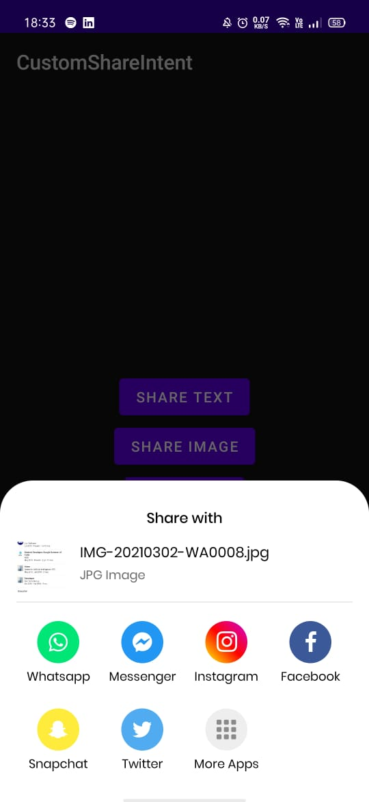
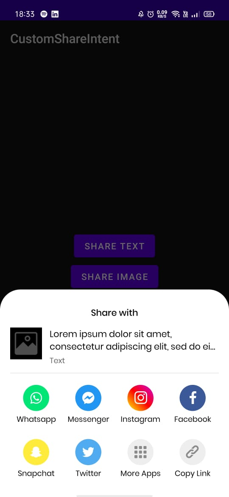

# AppyHigh Utils Share Intent Module

 

*This branch has been written in Java. Switch to the main branch for the Kotlin version*

This module packages a custom designed share intent which can be used with all types of files to give a customized user
interface to the application.

The applications highlighted in the share intent are as follows:
 - WhatsApp Messenger
 - Facebook Messenger
 - Instagram
 - Facebook
 - Snapchat
 - Twitter

In addition to the highlighted apps, there is an option to show more apps which opens up the default share intent of the 
operating system.

For Texts, there is an option which allows the user to copy the text to the clipboard.


| Share Intent for Text                    | Share Intent for Files                     |
|:----------------------------------------:|:------------------------------------------:|
|                  |                   |

<br />
<br />
<br />

#### Simple usage snippet
------
Start `CustomShare` from current `Activity` or `Fragment`:

### Specify the type of data. There are classes for two types of data. i.e. Texts and Files. So we create an object of the class `CustomShareDataText` for text data or `CustomShareFile` for files.

```kotlin

val dummy_text = "Lorem ipsum dolor sit amet"

// declaration of object for text data
val shareDataText = CustomShareDataText(dummy_text))

// declaration of object for files
val fileData = CustomShareFile(filePath, fileName, fileUri, mimeType)

```
<br />
<br />
<br />

### Required Variables for object `CustomShareDataText` :  
 - Text Data to be shared


<br/>

### Required parameters for object `CustomShareFile`:
 - `filePath`: the absolute path of the file in storage. This is used to show a preview of the file.
 - `fileName`: the name of the file to be shared. This is used to display the name of the file.
 - `fileUri`: the uri of the file. This is used to send data to the targeted application.
 - `mimetype`: the type of the file to be shared. This is used to set the mimeType of the share intent which then filters out the suitable receiving applications.

<br />
<br />
<br />

### Sample invocation of the function

```kotlin
CustomShare.getInstance(activity: this, fragmentManager: supportFragmentManager)
           .Builder()
           .setShareData(fileData)
           .show()
```


<br /><br /><br />
## Developed with :heart: by Abhishek Tiwari 